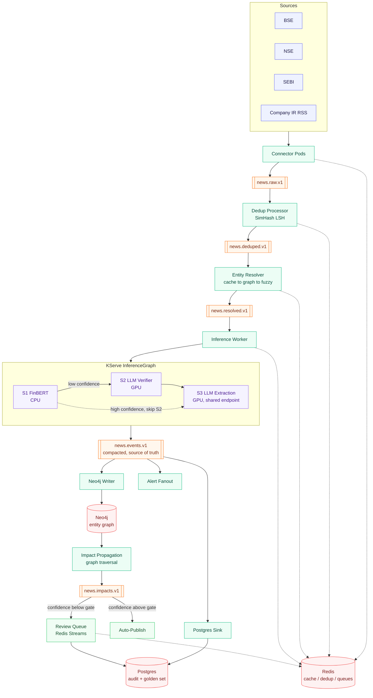

https://github.com/Sharkyii/Cascade

# Cascade

Cascade is a streaming ML platform that turns Indian financial news and regulatory
filings into structured, confidence-scored events. It runs incoming documents through
a cascade of pretrained models, resolves the companies and people mentioned against a
knowledge graph, and propagates the second-order impact of an event through that graph
(a negative filing at a supplier, for example, should surface the customers who are
exposed to it).

Cascade does not train models and does not produce trading advice. It extracts facts
and attaches a confidence score to them. What a reader does with that fact is up to
the reader.

## Why this exists

Financial news in India is fragmented across exchange announcements, SEBI filings,
and investor relations feeds. Reading all of it, resolving which company is actually
being discussed, and understanding who else is affected by a given disclosure is a
graph problem wearing a text-processing costume. Most systems either skip the graph
part entirely (treat every story as isolated) or skip the confidence part (treat every
extraction as fact). Cascade tries to do both properly.

## Architecture



Orange boxes are Kafka topics, green boxes are the workers that consume and produce
them, red cylinders are the derived stores, purple is the model cascade behind
KServe, and the dotted lines into Redis are the cache and queue touchpoints each
stage relies on. `news.events.v1` is the one topic in the middle that everything
downstream is rebuildable from; nothing after it holds information the log doesn't.

Full reasoning for each storage choice, the partitioning trade-offs, and what's
built versus still ahead lives in [docs/ARCHITECTURE.md](docs/ARCHITECTURE.md).

## Stack

- **Kafka** for the event backbone. `news.events.v1` is the source of truth; every
  other store is a derived, rebuildable view of it.
- **Redis** for five distinct jobs (dedup index, entity alias cache, inference cache,
  rate limiting, review queue), kept isolated by prefix and eviction policy.
- **Neo4j** for the corporate entity graph: companies, people, filings, and the
  temporal relationships between them. Used only where a query is actually a graph
  query (impact propagation, interlocking directors, entity disambiguation by
  proximity). If a query is just a primary-key lookup, it belongs in Postgres.
- **Postgres** for the audit log, review decisions, and the golden set.
- **KServe** for serving the model cascade (FinBERT on CPU, a shared vLLM-served
  Qwen2.5-7B for verification and extraction on GPU, scale-to-zero).
- **Kubeflow Pipelines + Katib** for everything that is scheduled or triggered rather
  than continuous: backfills, evaluation, the feedback loop, graph maintenance, and
  prompt/config search.

See [docs/ARCHITECTURE.md](docs/ARCHITECTURE.md) for the full data flow and the
reasoning behind each storage choice.

## Status

This repository has two things in it now. The reference design below (Kafka, Redis,
Neo4j, Postgres, KServe, Kubeflow) is at the start of Phase 1 in the build order: a
local skeleton that runs entirely on Docker Compose, with no Kubernetes cluster
required to develop against it. Later phases add the model cascade, the graph write
path, KServe deployment, the promotion gate, and chaos testing.

Alongside it, [cloudflare/](cloudflare/) is a real, live deployment of a first slice
of the same system, running on Cloudflare Workers plus three free-tier managed
services (Neon, Upstash, Neo4j Aura) instead of self-hosted infrastructure. It exists
because that combination needed no new credit card anywhere, unlike every VM/VPS
option. See [docs/DEPLOYMENT.md](docs/DEPLOYMENT.md) for the full reasoning, what's
substituted for what, and what's gained and lost by doing it this way.

## Repository layout

```
docker-compose.yml       Local dev stack: Kafka, Schema Registry, Redis, Neo4j,
                          Postgres, MinIO, and a Kafka UI for inspecting topics.
schemas/avro/             Avro schemas for every topic, registered against the
                          Schema Registry on startup.
neo4j/init/                Constraints and indexes, applied before any data loads.
postgres/init/              Audit log, review decision, and golden set tables.
services/                   Pure-function building blocks: dedup (SimHash LSH),
                          entity resolution (cache -> graph -> fuzzy match), and
                          the security master loader. services/streaming/ wires
                          the pure logic to real Redis, Neo4j, and Kafka.
connectors/                   BSE, SEBI, and IR RSS connectors (real, verified
                          against live feeds), plus connectors/social/ -- a
                          deliberately separate lane for Reddit. See
                          docs/DATA_SOURCES.md.
prompts/                     Versioned prompt files for S2/S3. Never inline a prompt
                          string in application code; see prompts/README.md.
golden_set/                  Labeled evaluation data and its schema.
pipelines/                    Kubeflow Pipelines (P1-P5), real KFP v2 code run
                          locally via kfp.local, no Kubernetes cluster needed.
katib/                        Katib search manifest + a real, standalone-testable
                          objective function. See katib/README.md for what
                          needs an actual cluster versus what doesn't.
docs/                        Architecture, data sources, graph model, evaluation,
                          cost, runbook, deployment, and failure mode documentation.
cloudflare/                  Live deployment: Cloudflare Workers + Neon + Upstash +
                          Neo4j Aura. See docs/DEPLOYMENT.md and cloudflare/README.md.
AGENTS.md                    How an AI coding agent should work in this repo.
CLAUDE.md                    Claude Code specific project instructions.
```

## Getting started

```bash
docker compose up -d
docker compose ps
```

This brings up Kafka (KRaft mode, single broker), Schema Registry, Redis, Neo4j,
Postgres, MinIO, and Kafka UI. Nothing here needs a Kubernetes cluster; KServe and
Kubeflow only enter the picture from Phase 6 onward, and even then the streaming
plane keeps running independently of them.

Run the service-level unit tests with:

```bash
cd services
pip install -r requirements.txt
pytest
```

## Non-negotiable constraints

- No model is trained from scratch. Every model in the cascade is pretrained and
  open-source.
- No output is phrased as investment advice. Extracted facts and a confidence score,
  nothing more.
- Only the data sources listed in [docs/DATA_SOURCES.md](docs/DATA_SOURCES.md) are
  ingested. No scraping of a source whose terms forbid it.
- Every component is testable locally through Docker Compose, without a cluster.
- Neo4j has to earn its place by answering queries that are genuinely painful in SQL.
  If it ends up doing only primary-key lookups, it gets removed.

## License

MIT. See [LICENSE](LICENSE).
